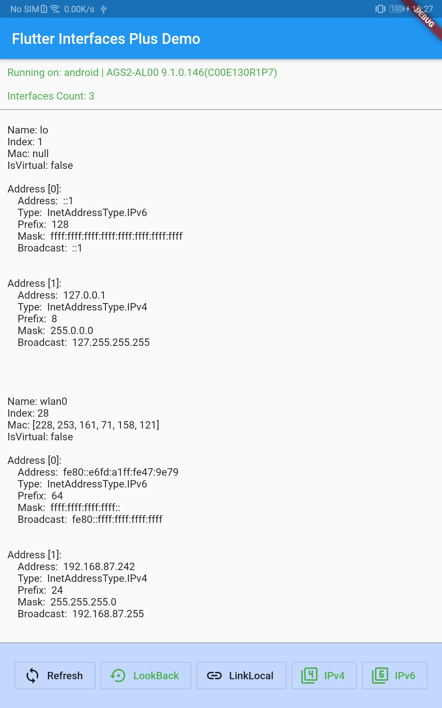

# Flutter Interfaces Plus (developing)
Enhanced Flutter network interface plug-in for multiple platforms.

### Platforms will be supported
Android、iOS、Windows、Linux、MacOS.

### Features will be supported
- Lists all network card interfaces for the platform.
- Contains information such as IP address, prefix length, mask, broadcast address, etc.
- Support IPv4 and IPv6.
- Support filtering (isLookBackAddress, isLinkLocal, isVirtual, etc.).
- Can be converted to `NetworkInterface` object of flutter.

### Example

